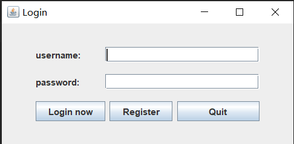
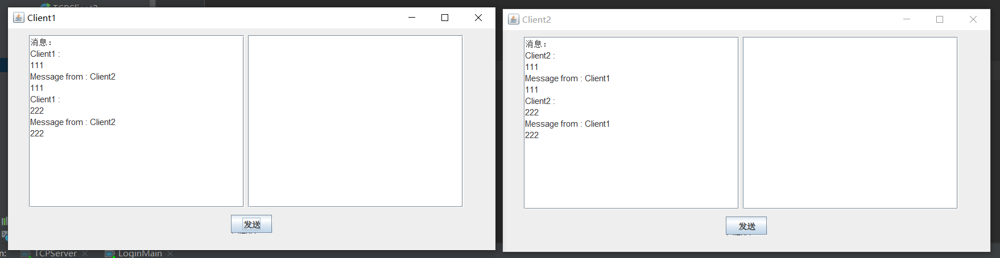

# ChatRoom

Create a chatroom with Java

项目配置：IntelliJ（jdk11），MySQL5

#### 2022.2.13 Version1

此版本实现的功能有：本机上的两个客户端可以随意接收发送信息，并将两者发送的信息保存在MySQL数据库当中

此版本使用到的知识有：**简单的**java基础，多线程，JDBC连接，MySQL，Java服务器编程，极少的计算机网络知识

未来版本展望：制作UI界面，可以任意添加客户端数量

项目结构：

​		src目录下的三个目录分别归属客户端，MySQL数据库和服务器。

​		Server目录中TCPServer包含了主方法，ServerThread封装了服务器功能。在ServerThread中让服务器的两个线程同时监听两个客户端，将监听内容存入数据库相应表中，再将内容输出给另一个客户端以完成通信。

​		Client目录包含了两个客户端目录，以及客户端的读线程和写线程。先打开服务器端后，依次打开两个客户端。

​		MySQL目录下InsertMessage封装了插入方法，将服务器监听到的内容存入数据库表中

#### **2022.3.6 Version2**

此版本实现的功能有：在Version1的技术上添加了可视化界面，为每个客户设置单独的输入框和输出框，如图

此版本使用到的知识有：swing界面设计，多线程

未来版本展望：优化界面设计，设置群聊天，设置登录和注册功能

项目结构：

Client目录下两个客户端文件各自新增了界面线程，新增ClientGUI.java界面文件

#### 2020.3.26 Version3

此版本实现的功能有：1.增加了登录与注册功能，注册用户直接写入服务器的数据库 2.增加了信息来源显示功能

​		登录与注册界面如下图所示

​		未注册点击登录会弹出警告

​		信息来源显示如下图所示

未来版本展望：增加多个用户，可以选择性建立连接，优化GUI界面

项目结构：

​		在原来的src文件夹中新增了Login子目录，用以存放登录界面、线程有关内容。CreateAccountGUI是创建用户时的GUI文件，LoginGUI是登陆界面，LoginThread是登陆线程，LoginMain是登录的主方法。同时MySQL文件中CreateAccount和CheckAccount文件分别用以在数据库中创建用户和检查用户是否存在。

​		项目开启方法：先开始服务器TCPServer，然后开启登录主方法LoginMain即可。

